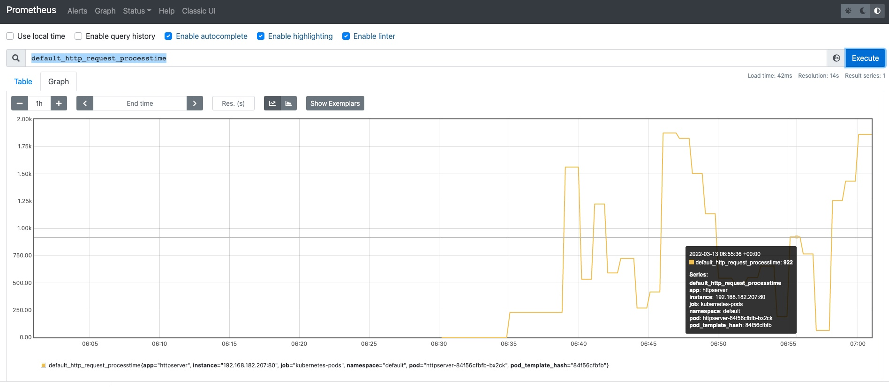
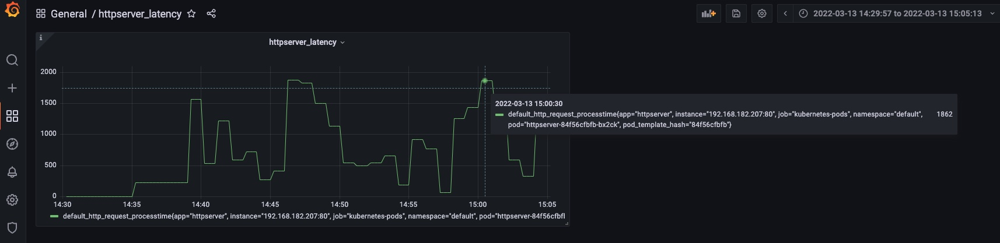

# 模块 10 作业

## 最终步骤：

```shell
# 在 Module8 基础上，先将 web.go 打成镜像 docker.io/hellodockerhello/httpserver:v4
# 更新 deployment，更新镜像版本及annotation 
kubectl apply -f httpserver-deploy-prom.yaml
# 安装 prometheus 及 grafana
见需求分步实现说明的详细步骤
# 客户端不断模拟访问有时延的路径"/"
watch curl $IP:Port/
# 使用 https://$NodeIP:$NodePort 登陆 prometheus 及 grafana，查看监控指标default_http_request_processtime
# grafana import json，加入展示面板
```


====================================================================

## 需求分步实现说明：

- 为 HTTPServer 添加 0-2 秒的随机延时；

  ```go
  // 定义函数，输入上下边界，随机输出中间任意 int 值
  func randInt(min, max int) int {
          rand.Seed(time.Now().UTC().UnixNano())
          return min + rand.Intn(max-min)
  }
  
  // 使用 Gauge 度量类型定义 processTime, 记录时延的瞬时快照
  processTime := prometheus.NewGauge(prometheus.GaugeOpts{
                   Namespace: "default",
                   Name:      "http_request_processtime",
                   Help:      "The process latency time of httpserver, expect between 0 to 2s",
               })
  
  // 当客户端访问 "/"时，添加 0-2 秒的随机时延, 并且将该值更新到 processTime
  http.HandleFunc("/", func(w http.ResponseWriter, r *http.Request) {
                   delay := randInt(0, 2000)
                   time.Sleep(time.Millisecond * time.Duration(delay))
                   io.WriteString(w, fmt.Sprintf("Delay Time: %d ms\n", delay))
                   processTime.Set(float64(delay))
               })
  ```

  

- 为 HTTPServer 项目添加延时 Metric；

  ```go
  // 将 processTime 注册到 metrics
  prometheus.Register(processTime)
  // 将 prometheus 的默认 handler 注册到 "/metrics"路径上
  http.Handle("/metrics", promhttp.Handler())
  ```

  

- 将 HTTPServer 部署至测试集群，并完成 Prometheus 配置；

  - Deployment 的更改，在 template 中的 metadata 增加 annotation，详见`httpserver-deploy-prom.yaml`

  ```yaml
  annotations:
  	prometheus.io/scrape: "true"
    prometheus.io/port: "80"
  ```

  - 部署 Prometheus 及 Grafana

    - 安装 helm

    ```shell
    wget https://get.helm.sh/helm-v3.8.1-linux-amd64.tar.gz
    tar zxvf helm-v3.8.1-linux-amd64.tar.gz
    sudo cp linux-amd64/helm /usr/local/bin/
    helm version
    ```

    

    - 安装 grafana

    ```shell
    helm repo add grafana https://grafana.github.io/helm-charts
    helm pull grafana/loki-stack
    tar -xvf loki-stack-2.6.1.tgz
    helm upgrade --install loki ./loki-stack --set grafana.enabled=true,prometheus.enabled=true,prometheus.alertmanager.persistentVolume.enabled=false,prometheus.server.persistentVolume.enabled=falase
    ```

    - loki-prometheus-server 启动报错没有 pvc，更改其 volume 类型为 emptyDir

    ```yaml
    # 执行命令
    kubectl edit deploy loki-prometheus-server
    
    ## 原先的 storage-volume 定义
    - name: storage-volume
    	persistentVolumeClaim:
    		claimName: loki-prometheus-server
    		
    ## 更改后的 storage-volume 定义
    - name: storage-volume
      emptyDir: {}
    ```

    - 将 loki-prometheus-server 及 loki-grafana 两个 svc 均从 ClusterIP 类型改为 NodePort 类型，使得 prometheus 及 grafana 均可从节点外网 IP 访问

    ```yaml
    # 执行命令
    kubectl edit service loki-prometheus-server 
    kubectl edit service loki-grafana
    
    ## 原先的 type
    type: ClusterIP
    
    ## 更改后的 type
    type: NodePort
    ```

    

- 从 Promethus 界面中查询延时指标数据；

  ```
  # 使用 NodePort 方式登陆 prometheus 界面
  https://$NodeIP:$NodePort1
  ```

  

- （可选）创建一个 Grafana Dashboard 展现延时分配情况。

  - 获取 grafana 的用户名及密码

    ```shell
    kubectl get secret loki-grafana -oyaml
    # 找到 admin-user 和 admin-password，并解码
    echo "xxx" | base64 -d 
    ```

    

  - 登陆 grafana

    ```shell
    # 使用 NodePort 方式登陆 prometheus 界面
    https://$NodeIP:$NodePort2
    
    # 输入上一步获得的用户名及密码，登陆
    ```

    

  - 添加 panel

    ```
    Create => Dashboard => Add a new panel => Edit title to "httpserver_latency" => Edit Description to "httpserver_latency" => Select Data source "Prometheus" => Metric browser 填入 "default_http_request_processtime" => save and apply
    ```

    

  - 展示

    

  - 导出（作为后续导入用）

    ```
    点击 share =》 Export =》 Save to file 保存到本地
    ```

  - 导入

    ```
    Create =》 Import =》 Upload JSON file =》 选择 "httpserver_grafana_latency.json" => Load
    ```

    