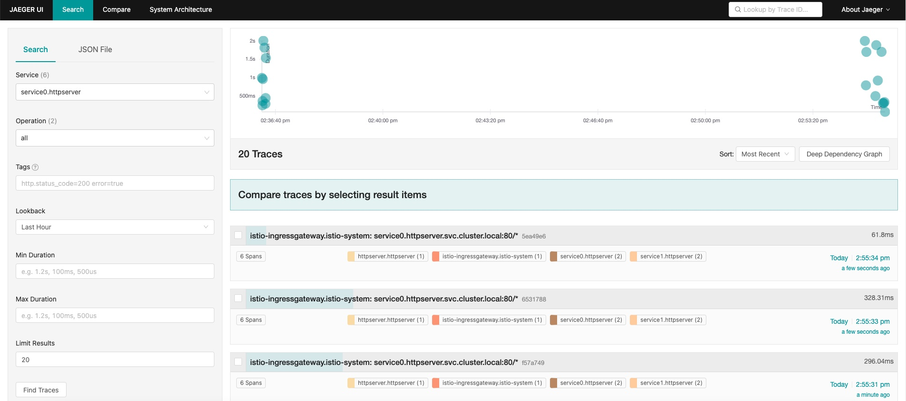
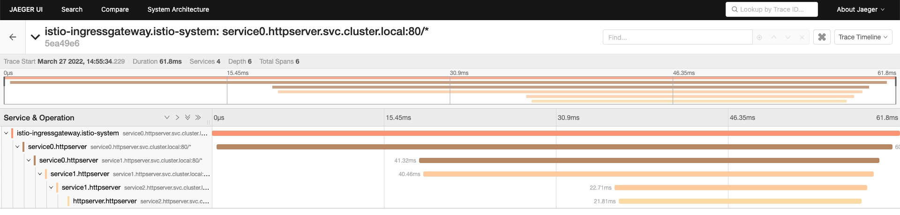

# 模块 12 作业

## 最终步骤：

1. 安装 Istio，最终期望用到它的 Ingress Gateway 能力、安全特性及可观察性来完成本模块作业

   ```shell
   # 通过 wget 下载 istio 1.12.0 版本
   wget https://github.com/istio/istio/releases/download/1.12.0/istio-1.12.0-linux-amd64.tar.gz
   # 解压并进入文件夹
   tar zxf istio-1.12.0-linux-amd64.tar.gz
   cd istio-1.12.0
   # 将 istioctl 二进制文件拷贝至系统 PATH 路径中 `/usr/local/bin/`
   cp bin/istioctl /usr/local/bin/
   # 安装 istio
   istioctl install --set profile=demo -y
   ```

2. 创建命名空间 httpserver，注入 label，然后依次部署服务应用、Service、VirtualService、证书及Gateway，最终做到以 Istio Ingress Gateway 的形式对外发布服务，且是有证书保证安全的

```shell
# 创建命名空间 httpserver
kubectl create ns httpserver
# 给 httpserver 命名空间打上 label，使得 istio 可以自动注入
kubectl label ns httpserver istio-injection=enabled
# 部署服务应用
kubectl apply -f http-config.yaml -n httpserver # 指定 httpserver 命名空间创建 ConfigMap
kubectl apply -f httpserver-deploy-prom.yaml -n httpserver # 指定 httpserver 命名空间创建 httpserver deployment，就用模块 10 的 yaml，不做改变
# 部署 Service（含 service0、1、2，其中 service0 直接用 cncamp 101 中 module12/istio/tracing/service0.yaml，service1 同理，而 service2 由之前作业的 httpserver-service.yaml 改了 metadata.name 得到）
# 最终的效果是从 VirtualService 流入到 service0 的流量，其流量追踪的 Header 会被一直传递到后端服务，供流量追踪使用
kubectl apply -f service0.yaml -n httpserver 
kubectl apply -f service1.yaml -n httpserver
kubectl apply -f httpserver-service.yaml -n httpserver

# 配置证书
openssl req -x509 -sha256 -nodes -days 365 -newkey rsa:2048 -subj '/O=cncamp Inc./CN=*.cncamp.com' -keyout cncamp.com.key -out cncamp.com.crt # 使用 openssl 生成证书及密钥
kubectl create -n istio-system secret tls cncamp-tls --key=cncamp.com.key --cert=cncamp.com.crt # 将证书及密钥配进 istio-system 命名空间的 cncamp-tls secret 中，供 Gateway 使用

# 配置 VirtualService 及 Gateway，使得经过 Gateway 可以绑定在 istio ingressgateway，并且配置在 Gateway 上终结证书，然后由 VirtualService 将匹配的流量导到后端的 service0
kubectl apply -f istio-specs.yaml -n httpserver

# 将 istio-ingressgateway svc 的类型改为 NodePort
kubectl edit svc -n istio-system istio-ingressgateway # 改为 type: NodePort

# 获取 istio-ingressgateway 对外暴露的 ip、port，配置并最终访问
kubectl get svc -n istio-system istio-ingressgateway # 记录 443 对应的映射端口 $NodePort，$NodeIP 由节点外网 IP 得到
echo $NodeIP httpserver.cncamp.com >> /etc/hosts # 设置 hosts 文件，将 httpserver.cncamp.com 静态映射为 $NodeIP

# 实际访问
curl  https://httpserver.cncamp.com:$NodePort/ -v -k
```

3. 安装 jaeger，设置采样率，变更 svc 为 NodePort 方式，实际请求并观察

```shell
# 安装 jaeger
kubectl apply -f jaeger.yaml

# 设置采样率
kubectl edit configmap istio -n istio-system # defaultConfig.tracing.sampling 设为 100

# 将 tracing 的 svc 类型改为 NodePort
kubectl edit svc -n istio-system tracing # 改为 type: NodePort，更改后记录 $TracingPort

# 访问 100 次
for i in {1..100}; do curl https://httpserver.cncamp.com:$NodePort/ -v -k; done

# web 访问 Jaeger
http://$NodeIP:$TracingPort
```

====================================================================

## 需求分步实现说明：

把我们的 httpserver 服务以 Istio Ingress Gateway 的形式发布出来，需要考虑：

- 如何实现安全保证

  - 配置证书及 secret

    ```shell
    # 配置证书
    openssl req -x509 -sha256 -nodes -days 365 -newkey rsa:2048 -subj '/O=cncamp Inc./CN=*.cncamp.com' -keyout cncamp.com.key -out cncamp.com.crt # 使用 openssl 生成证书及密钥
    kubectl create -n istio-system secret tls cncamp-tls --key=cncamp.com.key --cert=cncamp.com.crt # 将证书及密钥配进 istio-system 命名空间的 cncamp-tls secret 中，供 Gateway 使用
    ```

  - Gateway 使用证书

    

    ```yaml
    apiVersion: networking.istio.io/v1beta1
    kind: Gateway
    metadata:
      name: httpserver
    spec:
      selector:
        istio: ingressgateway
      servers:
        - hosts:
            - "*"
          port:
            name: httpserver
            number: 443 # 指定端口为 443
            protocol: HTTPS # 指定协议为 HTTPS
          tls:
            mode: SIMPLE
            credentialName: cncamp-tls # 使用证书
    ```

    

- 七层路由规则

  ```yaml
  # 用 VirtualService 对象，匹配 hosts 及 match 规则的流量导到 destination 配置的后端去
  apiVersion: networking.istio.io/v1beta1
  kind: VirtualService
  metadata:
    name: httpserver
  spec:
    gateways:
      - httpserver
    hosts:
      - "*"
    http:
      - match:
          - uri:
              prefix: /
        route:
          - destination:
              host: service0.httpserver.svc.cluster.local
              port:
                number: 80
  ```

  

- 考虑 open tracing 的接入

  ```shell
  # 详见最终步骤的 2、3，主要关注 service 配置将追踪的 Header 一直带下去的代码改动，以及 Jaeger 的安装配置及查看步骤
  ```

  